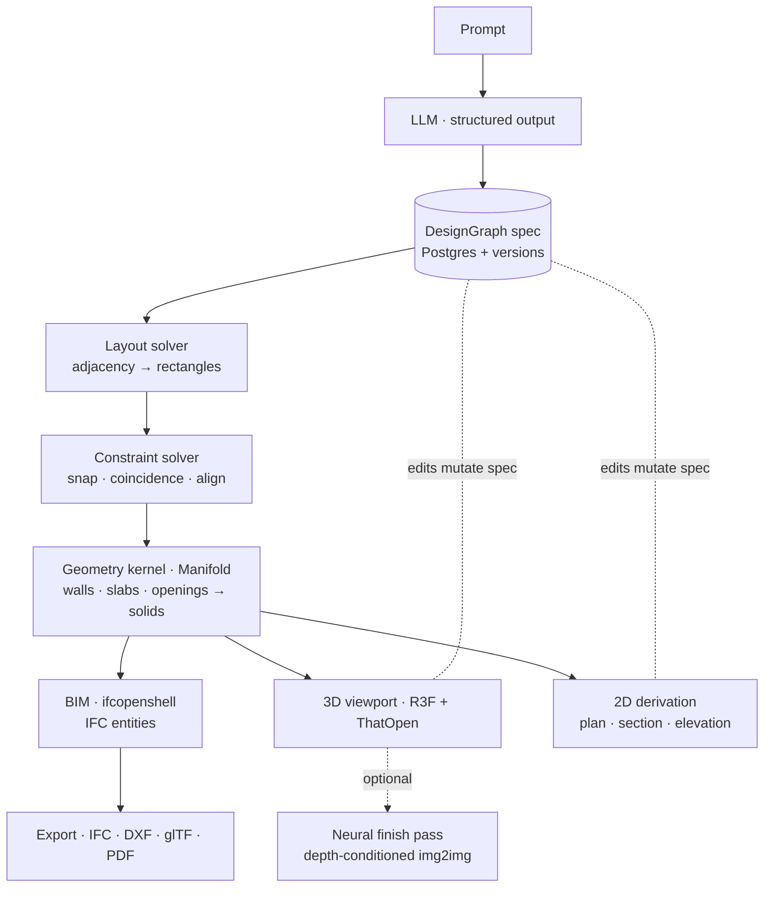

# KATHA — Spatial Kernel & Stack Spec

**Scope:** natural-language prompt → real architectural output (plans, sections, elevations, 3D model, IFC). Not "diagram-shaped images." Actual drawings an architect would accept.

**Status:** reconciliation of external stack research against the current KATHA codebase. This is the *what and why*; per-layer implementation tickets come after.

**Verdict legend:** ✅ Have · 🟡 Partial · 🔴 Missing · ⭐ Adopt · ⛔ Kill / replace

---

## 0. The governing decision (non-negotiable)

> **The LLM must not emit geometry.**
> The LLM emits a **structured parametric spec**. A **deterministic geometry kernel** builds from that spec. This is the difference between a demo and a product.

```
prompt
  → LLM (structured output)
  → Design Spec  (program, rooms, adjacencies, dims, constraints, site)
  → Layout solver      (graph → rectangles → walls)
  → Constraint solver  (snap, coincidence, alignment)
  → Geometry kernel    (walls, slabs, openings, roofs → solids)
  → BIM model          (IFC entities, not dumb meshes)
  → 3D viewport  +  2D drawing derivation (plan / section / elevation)
  → Export (IFC, DXF, glTF, PDF)
```

Every step is inspectable and editable. **Raster diffusion → vectorize is a valid seeding path but a dead end as the core.**

**KATHA already obeys this.** `DesignGraph` ([`backend/app/models/design_graph.py`](../backend/app/models/design_graph.py)) is the spec; it is what we persist and version — **not** geometry. We are not starting the hardest architectural decision; we already made it right.

---

## 1. Where KATHA stands today (the honest map)

| Layer | What the research wants | KATHA today | Verdict |
|---|---|---|---|
| **0 · Spec, not geometry** | LLM → spec JSON, store the spec | `DesignGraph` (Pydantic); Postgres stores spec + version history | ✅ **Have** |
| **0b · Spec depth** | typed program / rooms / adjacencies / openings | `spaces`, `objects`, `geometry`, `constraints` are `list[dict]` — loose interiors | 🟡 Formalize sub-schemas |
| **1 · Geometry kernel** | Manifold (mesh) + OCC (B-rep), booleans in a worker | hand-rolled boxes in [`gltf_exporter.py`](../backend/app/services/exporters/gltf_exporter.py); **no booleans** | 🔴 **Add Manifold** |
| **2 · BIM / IFC** | web-ifc / IfcOpenShell, openings as voids | [`ifc_exporter.py`](../backend/app/services/exporters/ifc_exporter.py) — real `ifcopenshell`, openings **void** the wall, filled by IfcWindow/Door; `ifc_importer` too | ✅ **Have (server)** · 🟡 add browser viewer |
| **3 · Constraint / layout solver** | planegcs + kiwi + OR-Tools | [`graph_normalizer.py`](../backend/app/services/graph_normalizer.py) does units/axis/bounds/edge-snap only | 🔴 **Add solver** |
| **4 · Rendering / viewport** | three + r3f + drei + bvh + camera-controls | `three@0.183`, `@react-three/fiber@9`, `drei@10`, `zustand@5` installed; **workspace is a Gemini-image gallery, no live model** | 🟡 Base present, build viewport |
| **5 · 2D drawing layer** | tldraw editor; DXF; **HLR** sections | [`drawings/`](../backend/app/services/drawings/): plan/section/elevation/iso/detail SVG w/ **poché, dim chains, scale bars**; `dxf_exporter` | ✅ **Strong (graph-projected)** · 🟡 HLR + editing |
| **6 · AI generation** | structured output → spec; **precedent retrieval**; eval harness | LLM → graph works; pgvector present (ADR-0001); no plan-precedent RAG; no layout eval | 🟡 Add retrieval + eval |
| **7 · State / collab / persistence** | Yjs/Loro multiplayer; zustand; store spec | `zustand` installed; Postgres spec + versions | ✅ Persistence · 🔴 multiplayer |
| **8 · Site & context** | MapLibre / deck.gl / suncalc | `geojson_exporter`; no map/site/sun | 🔴 Defer (suncalc = cheap win) |
| **9 · Analysis / credibility** | Ladybug/Radiance; area schedules; **code checks** | agent tools: `codes.py`, `clearances.py`, `ergonomics.py`, `mep_hvac/electrical/plumbing`, `cost.py`, `manufacturing.py`, `specs.py` | 🟡 **Scaffolded** — wire into pipeline |
| **★ The render** | kill raster-as-core | **Gemini (`gemini-2.5-flash-image`) IS the hero render** — [`image_service.py`](../backend/app/services/image_service.py) | ⛔ **Demote Gemini** |

**Takeaway:** KATHA has already built the research's Phase 1–2 *spine* (spec → BIM → drawings), server-side in Python. What's missing is (a) a real geometry kernel for the interactive model + render, (b) the constraint/editing layer, (c) a browser 3D/BIM viewport, and (d) removing Gemini from the core. We are connecting existing organs, not building a body.

---

## 2. Target pipeline



The **spec is the single source of truth.** Geometry, IFC, drawings, and renders are all *derived* from it. Editing anywhere mutates the spec; artifacts re-derive.

---

## 3. The one fork to decide: where geometry runs

The research is **browser-wasm-centric** (Manifold-wasm, web-ifc, ThatOpen, planegcs). KATHA's existing investment is **server-Python** (ifcopenshell, SVG drawings). Picking one blindly either throws away working code or bottlenecks interactivity.

**Decision — hybrid, spec-bridged:**

| Concern | Runs where | Why |
|---|---|---|
| LLM → spec, layout/constraint solve, **authoritative** solids, IFC, drawings, export, analysis | **Server (Python)** | Generation is a batch job; `ifcopenshell` is "the serious tool"; reuses working code |
| Interactive viewport, drag-time edits, plan-canvas editing, preview booleans | **Browser (wasm)** | Editing must be instant + local |
| **Kernel** | **Manifold — both sides** | `manifold3d` (Python, server) **and** `manifold-3d` (wasm, browser) = *identical* booleans; no drift |

The **DesignGraph spec is the contract** between them. Do **not** rewrite the working `ifcopenshell` pipeline in web-ifc; use ThatOpen **Fragments** only to *display* server-built IFC in the browser.

---

## 4. Stack by layer (annotated)

### 1 · Geometry kernel
| Library | Role | KATHA |
|---|---|---|
| **Manifold** (`manifold3d` py / `manifold-3d` wasm) | walls, slabs, openings, booleans — hot path | ⭐ **Adopt, both runtimes** |
| OpenCascade.js / `replicad` | fillets, lofts, sweeps, STEP/IGES; **HLR** for section/elevation | ⭐ Adopt behind a worker, export + curves only |
| three-bvh-csg | drag-time preview booleans | 🟡 Later (edit phase) |

### 2 · BIM
`ifcopenshell` (server) ✅ **keep** · `web-ifc` + `@thatopen/components` + `@thatopen/fragments` (browser **viewer only**) ⭐ adopt · IfcOpenShell validation/clash ✅ have the engine, wire it · **Speckle** (Revit/Rhino/ArchiCAD interop) ⭐ adopt in Phase 5 — this is the distribution wedge (aligns with EU/ArchiCAD priority). Export targets: **IFC4 · DXF · glTF · PDF** (have exporters) → add **OpenUSD** later.

### 3 · Constraint / layout
`@salusoft89/planegcs` (2D GCS, driving + **temporary** constraints for mouse-drag) ⭐ browser · `kiwi.js` (soft layout) ⭐ · **OR-Tools** (program allocation, rectangle packing) ⭐ server. Path: **adjacency graph → rectangular dissection → constraint relaxation → wall centerlines.** `graph_normalizer` is the embryo of the relaxation step — grow it.

### 4 · Viewport
`three` + `@react-three/fiber` + `drei` ✅ · `three-mesh-bvh` (selection perf) ⭐ · `camera-controls` (CAD nav — **real camera angle control**, replacing Gemini's text-clause "camera") ⭐ · `postprocessing` (SSAO/outlines — models look flat without AO) ⭐ · `three-gpu-pathtracer` (presentation renders) 🟡.

### 5 · 2D drawing layer *(the moat)*
Keep the Python SVG drawings ✅. Add: **`tldraw`** for interactive plan editing ⭐; **HLR** (OCCT `HLRBRep`) for section/elevation of complex geometry ⭐ (today they're graph-projected — fine for orthogonal, breaks on curves); extend `dxf_exporter` + `pdf_exporter` into real **sheet sets** (title block, north arrow, lineweights). Derivation rules: **plan = horizontal cut at ~1.2 m + projection below; section/elevation = hidden-line removal from solids.**

### 6 · AI
Structured-output spec ✅. Add **precedent retrieval** (embeddings over a curated plan library — pgvector already chosen, ADR-0001) — *ship before cold generation*. Add an **eval harness**: constraint compliance %, circulation validity, code checks, cross-storey structural plausibility. Lineage to read: **Architext** (closest framing), **HouseDiffusion** (production-usable vector plans), **Graph2Plan**, **DStruct2Design** (schema design), **FloorplanMAE** ("finish my sketch").

### 7 · State / collab
`zustand` + `immer` (patch undo/redo) ✅/⭐ · **Yjs** or **Loro** (CRDT multiplayer) + y-websocket/Liveblocks/PartyKit ⭐ Phase 5. **Store the spec, regenerate geometry** ✅ already true.

### 8 · Site & context (defer)
MapLibre GL · deck.gl · Overture/OSM footprints · Cesium (terrain) · **`suncalc`** (shadow studies — cheap, high perceived value) ⭐ early demo win.

### 9 · Analysis (credibility)
Wire the existing `codes.py` / `clearances.py` / `ergonomics.py` / `mep_*` tools into the generate→validate loop 🟡. Add **area schedules / FAR-FSI / coverage / efficiency ratio** (trivial to compute, disproportionately valued). Later: Ladybug/Honeybee + Radiance daylighting; three.js shadow studies as the cheap version.

---

## 5. Where Gemini lives now

Gemini is trap #1 as the *core*. It keeps exactly two legitimate homes, both non-authoritative:

1. **Neural finish pass** *(optional, off for "buildable" outputs)* — depth/normal-conditioned img2img **over the kernel's real render**, to make presentation images photoreal. Never the source of truth.
2. **2D sketch revitalization** — genuine 2D→2D style transfer (img2img + ControlNet-scribble).

Everything else Gemini does today — the hero render, "camera adjustment," and the vision-grounding hotspot hack — is **replaced** by: kernel render + real camera + hotspots as exact camera-projected boxes. (This retires `object_grounding.py`; boxes become geometry, not guesses.)

---

## 6. Resolved open decisions

| Decision | Call | Rationale |
|---|---|---|
| Kernel: mesh vs B-rep | **Mesh-first (Manifold)**, B-rep (OCC) for export/curves | Fast, simple hot path; correctness where it's needed |
| Geometry: browser vs server | **Both — hybrid, spec-bridged, Manifold on each side** | Reuse Python assets; keep editing instant |
| Segment: residential vs commercial | **Residential first** | Data + legible constraints (RPLAN/CubiCasa); commercial follows on the same kernel |
| Positioning: standalone vs plugin | **Standalone, + Speckle interop** (Phase 5) | Own the surface; interop is the wedge into Revit/Rhino/ArchiCAD |
| Datasets | **CubiCasa5K + Swiss Dwellings first** | Permissive/open; RPLAN & LIFULL licensing is restrictive — clear before training |

---

## 7. Build order (adapted to KATHA's real starting point)

- **Phase 0 — Consolidate the spec** *(you're mostly here).* Formalize `DesignGraph` sub-schemas (Room / Wall / Opening / Adjacency); make the graph the one contract every layer reads.
- **Phase 1 — Real geometry + demote raster.** Add **Manifold (Python)** → build walls/slabs/openings solids from the spec (replace box glTF). Render server-side with a real camera → base + depth + normal + **exact projected hotspots**. Move Gemini to finish-pass. *(This is the kernel spike already begun — upgraded from hand-boxes to Manifold booleans.)*
- **Phase 2 — Browser viewport.** R3F + **ThatOpen Fragments** viewer of the server IFC/glTF; `camera-controls`; SSAO/outlines. The workspace shows a **live model**, not a Gemini image.
- **Phase 3 — Editable.** `planegcs` + `tldraw` plan canvas; bidirectional 2D↔3D sync via the spec; undo/redo; Manifold-wasm drag-time preview.
- **Phase 4 — Defensible drawings.** HLR sections/elevations; annotation/dimension polish; DXF/PDF **sheet sets**; wire code checks into the pipeline.
- **Phase 5 — Collaborative.** Yjs multiplayer, comments, versioning UI, **Speckle** interop.

---

## 8. Known traps (and KATHA's exposure)

1. **Vectorizing diffusion output** → unbuildable. *KATHA is exposed today via the Gemini core — §5 fixes it.*
2. **Wasm bundle size** (OCC ~30 MB) → custom-build, lazy-load, worker-isolate; Next.js needs webpack wasm/worker config.
3. **ThatOpen version drift** → pin `three` / `@thatopen/*` / `web-ifc` together.
4. **Storing geometry instead of spec** → *KATHA already stores the spec.* ✅ Keep it that way.
5. **Floating-point wall joins** → snap to a **1 mm grid at the spec level.** (Extend `graph_normalizer`.)
6. **Ignoring the section** → section/elevation are where "actual" is proven and competitors stop. *KATHA already has them — protect and deepen with HLR.*
7. **Units** → **millimeters internally, always;** convert at the boundary. (`graph_normalizer` already stamps metric — tighten to mm.)
8. **Main-thread geometry** → every kernel call in a worker or the UI locks.

---

## Appendix — install reference, links, lineage

```bash
# core
npm i three @react-three/fiber @react-three/drei three-mesh-bvh camera-controls
# BIM (browser viewer)
npm i web-ifc @thatopen/components @thatopen/components-front @thatopen/fragments
# geometry
npm i manifold-3d                     # browser (wasm)
pip install manifold3d                # server (Python) — same kernel
npm i replicad replicad-opencascadejs # if B-rep needed
# constraints
npm i @salusoft89/planegcs kiwi.js
# 2D + export
npm i tldraw @tarikjabiri/dxf makerjs
# state / collab
npm i zustand immer yjs y-websocket
# geo
npm i maplibre-gl deck.gl suncalc
```

**Links:** ThatOpen `github.com/ThatOpen` · docs `docs.thatopen.com` · Manifold `github.com/elalish/manifold` · OpenCascade.js `ocjs.org` · replicad `replicad.xyz` · planegcs `github.com/Salusoft89/planegcs` · IfcOpenShell `ifcopenshell.org` · Speckle `speckle.systems` · tldraw `tldraw.dev` · awesome-cad `github.com/mlightcad/awesome-cad`

**Research lineage:** Graph2Plan · House-GAN++ · **HouseDiffusion** · **Architext** · DStruct2Design · FloorplanMAE
**Datasets:** RPLAN (restricted) · LIFULL HOMES (application) · **CubiCasa5K** (permissive) · **Swiss Dwellings** (open)

**Related ADRs:** [0005 IFC not RVT](adr/0005-ifc-not-rvt.md) · [0001 pgvector](adr/0001-pgvector-over-pinecone.md) · [0002 Anthropic + OpenAI](adr/0002-anthropic-plus-openai.md)
